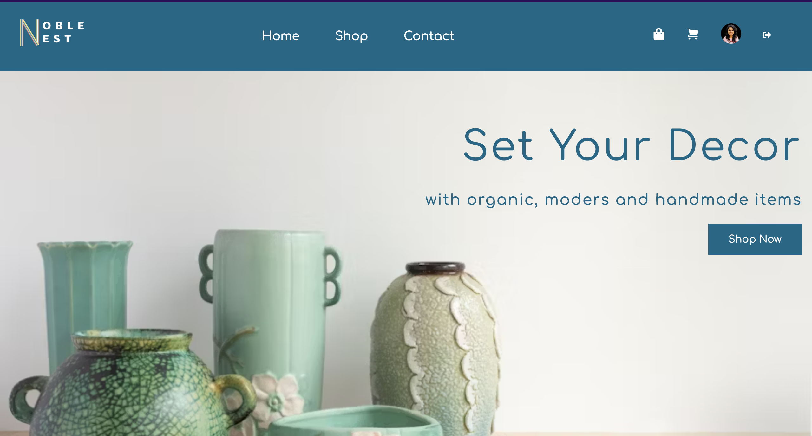

  
  <h1 align="center">NobleNest</h1>
  
Application to connect local artisans with consumers

Here is quick walkthrough of the project: 

## 🔍 Overview 
Here's a short overview of the project. It's a full stack web application that helps to connect local artisans directly with their consumers with no-middle intervention. 

## ✨ Features 
This system has lots of features such as:
- Developed a fully-featured eCommerce platform with functionalities like incorporating comprehensive product management, user authentication, and order processing.
- Designed and implemented an advanced admin dashboard with real-time analytics, interactive charts, and detailed reports on sales, and inventory.
- Built a dynamic product management system supporting CRUD operations and advanced search, sort and filtering capabilities.
- Created a robust customer management system with features for tracking user profiles and  purchase history, and support interactions.
- Developed a flexible coupon management system to handle various promotional strategies and track coupon usage.
- Implemented an efficient order and inventory management module with real-time updates and stock level monitoring.
- Optimized website performance for improved load times and user experience across devices, ensuring mobile responsiveness and cross-browser compatibility.

## ⚡️ Technologies
The application uses different technology including:
- ReactJS with Typescript for frontend 
- NodeJS/Express with Typescript backend 
- SCSS for styling
- Redux Toolkit & RTK Query for state management
- MongoDB for Database management

## 🍕 Getting Started 

Here we will setup our development environment. But first, we will need to install the following tools.

**Steps**
1. Clone the repository to local machine using command git clone `repo link` 
For frontend - `git clone https://github.com/sonaljain067/noblenest`
For backend - `https://github.com/sonaljain067/noblenest_backend`

2. Navigate to project directory through command line

3. Install the required project dependencies by running `npm install`

4. Start the development server by running `npm run dev`

This will start the backend application at http://localhost:8000 and frontend application on your local machine at http://localhost:5174/. 
You can then open this URL in your web browser to view the application.